# ✈️ Flight Fare Analysis Dashboard (India)

This project focuses on analyzing flight fare patterns across major Indian cities using **Excel**.  
It explores how different factors like number of stops, airline, class, and days left to departure affect flight prices.

---

## 📁 Dataset Info

- **Source:** Kaggle (Domestic Indian Flights Dataset)  
- **Rows:** 300,154  
- **Columns:** 12 features including:  
  - Airline, Source & Destination Cities  
  - Departure/Arrival Times  
  - Stops, Duration, Class  
  - Days Left to Departure  
  - Price  

---

## 🧹 Steps Performed

1. Cleaned and formatted raw data for analysis.
2. Created multiple pivot tables to analyze:
   - Airline-wise pricing
   - Price vs Time (departure, arrival)
   - Price vs Stops, Class, Duration, Days Left
3. Added slicers for interactive filtering.
4. Used conditional formatting to highlight pricing trends.
5. Built a fully interactive Excel dashboard.

---

## 📊 Key Insights

- ✈️ **Non-stop flights** were significantly cheaper on average.
- ⏰ **Prices increased** as the departure date approached.
- 🏷️ **Business class** fares were consistently higher across all airlines.
- 🕐 **Evening flights** had higher prices than morning ones.

---

## 🧰 Tools Used

- Microsoft Excel  
- Pivot Tables  
- Slicers  
- Conditional Formatting  
- Charts (Column, Line, Pie)

---

## 📸 Sample Visualizations

> 📝 Screenshots of dashboard and analysis

- 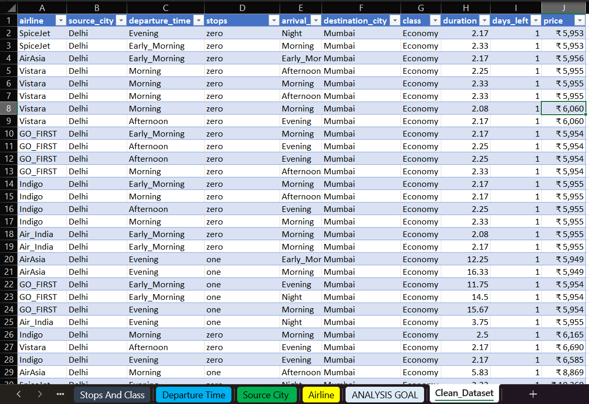
- 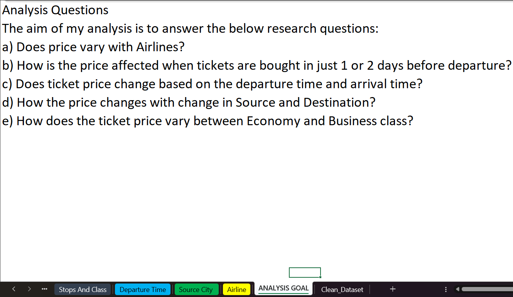
- 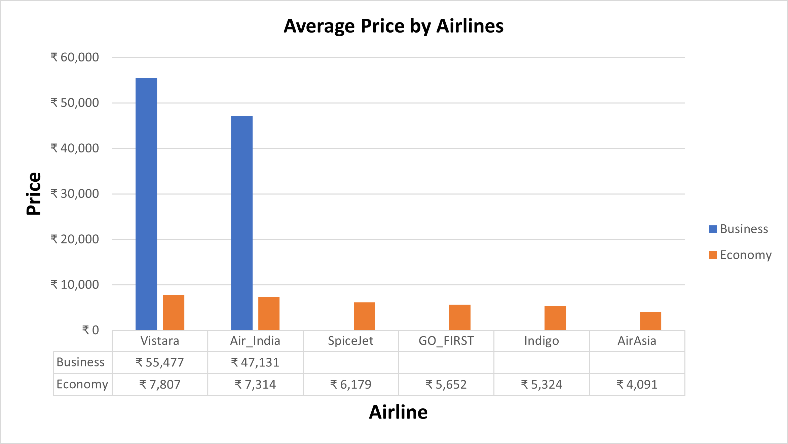
- 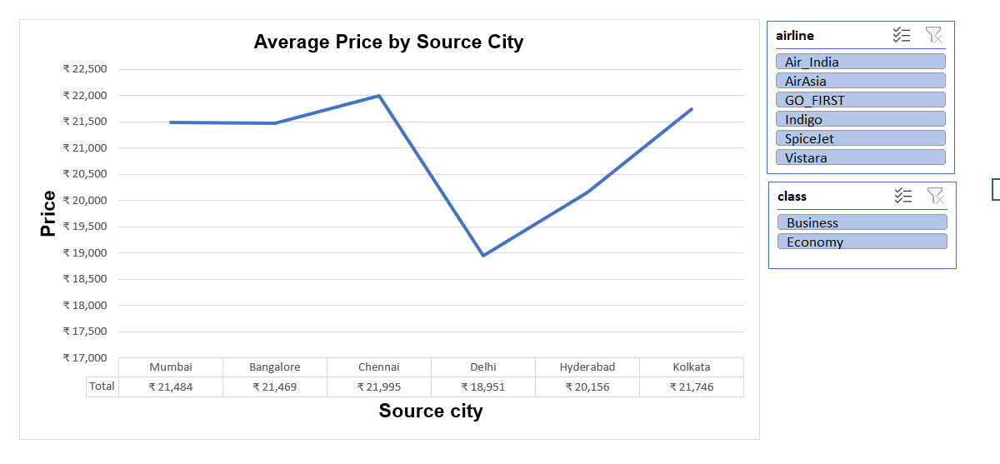
- 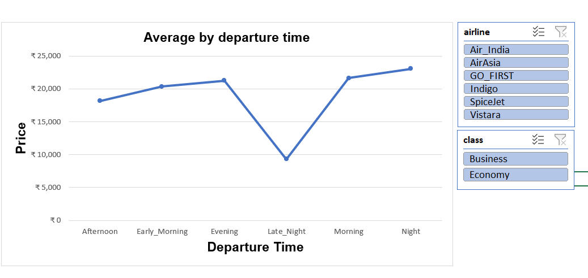
- 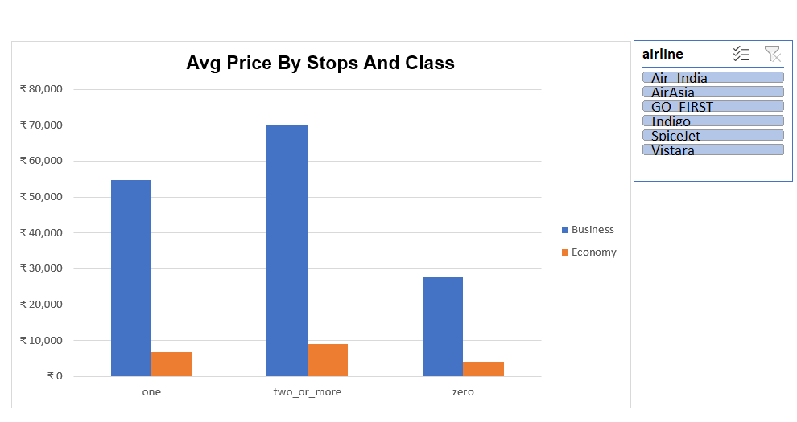
- 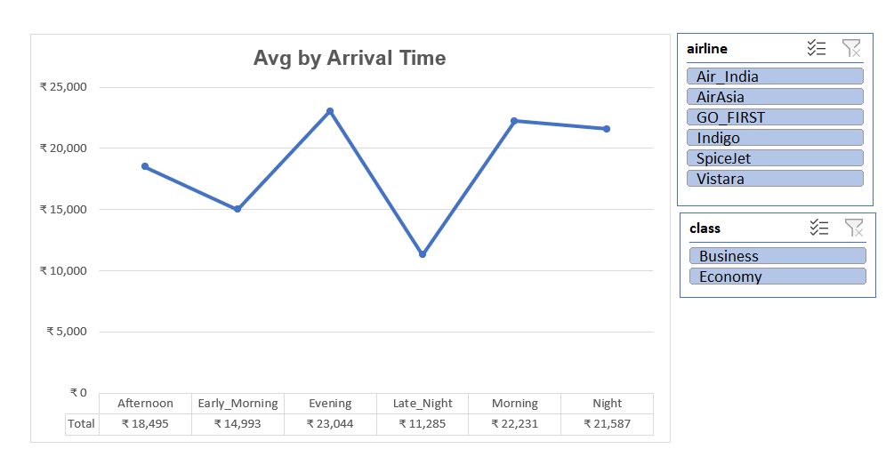
- 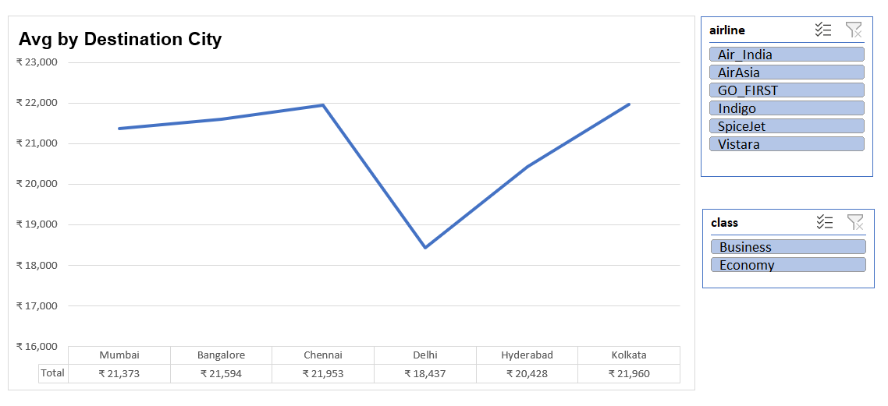
- 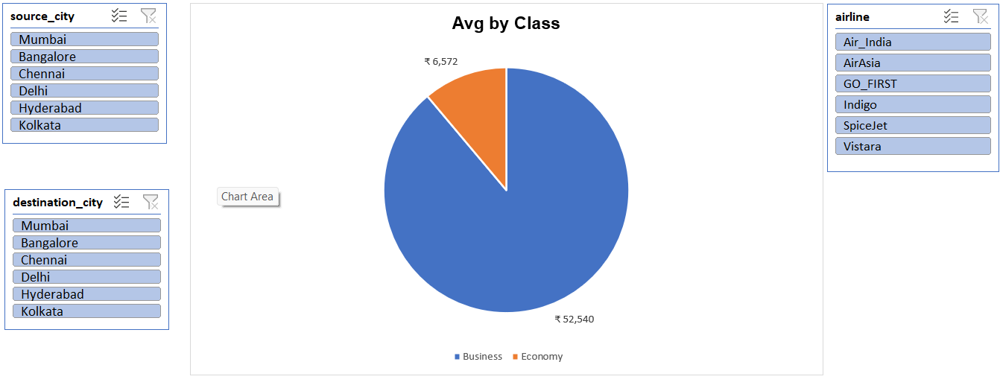
- 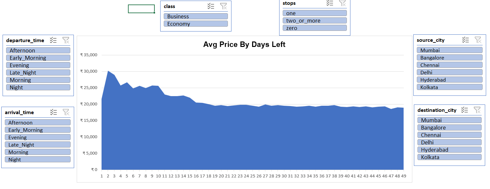
- 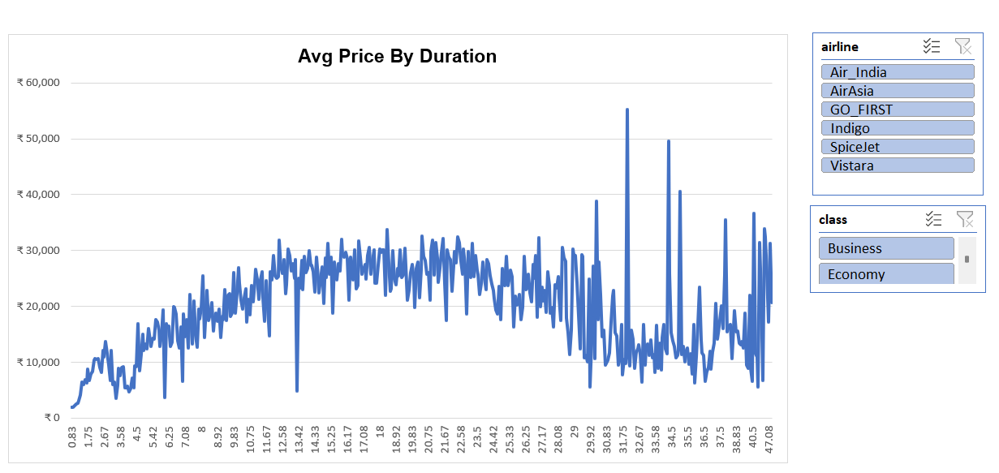
- .png)

---

## 🚀 How to Explore

1. Download the Excel file: `Flight_Price_Analysis(Dashboard).xlsx`
2. Open it in Excel (2016 or later)
3. Use slicers and filters to interact with the dashboard

---

## 📎 Project Status

✅ Completed and fully documented  
✅ Hosted with visuals, screenshots, and Excel dashboard  
📌 Available on [GitHub](https://github.com/rohitbisht02/Excel_Projects/tree/main/Flight_Fare_Dashboard)
